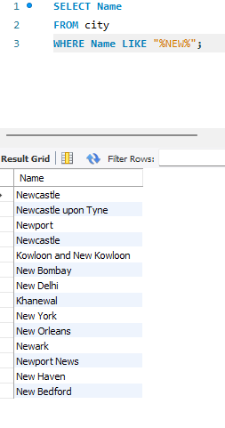
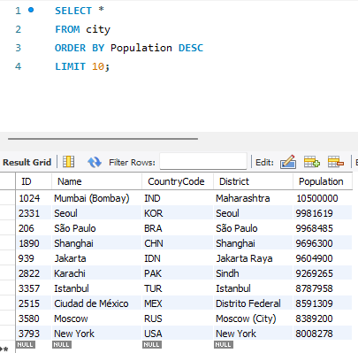
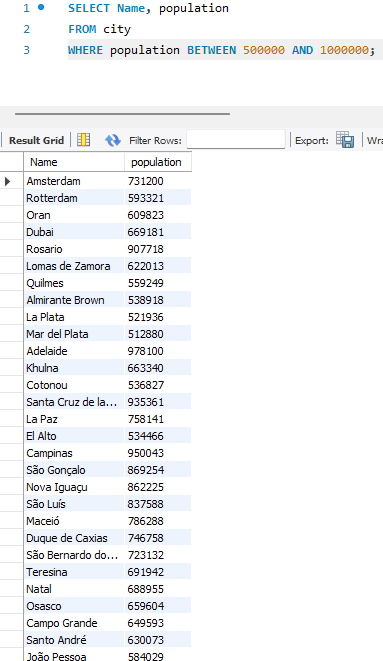
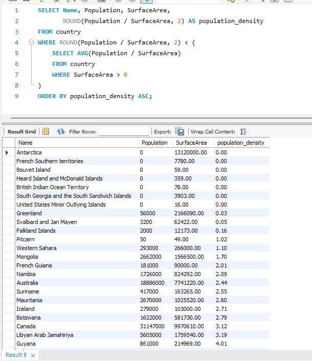
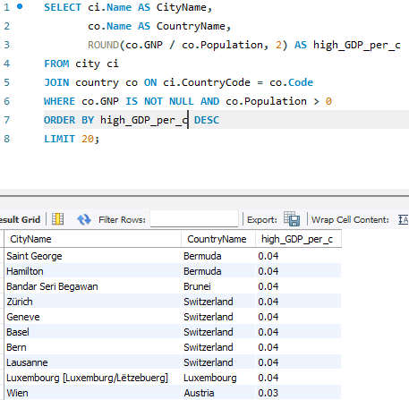
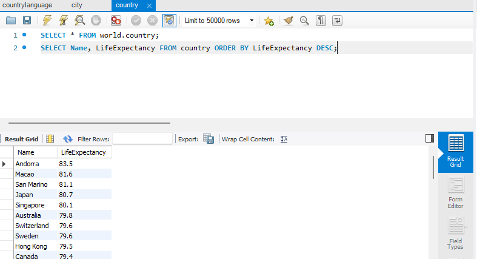

# Bootcamp - Week 3
This is the Workbook for Week 3 of a course delivered by Just IT, completed by Laura Brown.

This week's content was heavily focused on foundational database concepts and intensive SQL practical application.

## Key Topics and Skills Demonstrated

## Database Concepts and Design

This section demonstrates a strong theoretical understanding of database structures and relationships:

- **Keys**: Defined and differentiated between Primary Keys (unique row identifiers, ideally using a natural key or GUID) and Secondary Keys (non-necessary keys that aid in data retrieval/efficiency). Explained how Foreign Keys link different tables by using other tables' Primary Keys.

- **Relationships**: Provided real-world examples for one-to-one (e.g., person-to-National Insurance number), one-to-many (e.g., customer-to-orders), and many-to-many (e.g., students-to-courses) relationships.

- **Database Types**: Compared and contrasted Relational Databases (RDBMS), which scale vertically and use a fixed schema, with Non-Relational (NoSQL) Databases, which scale horizontally and are more flexible. Identified unstructured data as benefiting from the NoSQL model.

- **SQL JOIN Types**: Explained and provided use-case examples for key SQL JOINs: Self-join, Right join, Full join, Inner join, Cross join, and Left join.

## Database Creation & Maintenance

This task outlines a systematic approach to setting up a database system for a small retail business:

- **Requirements & Design**: Defined the data to be stored (inventory, sales, customers, loyalty program) and the users (manager, sales assistant, IT support). Proposed a snowflake schema for linking tables, including relationships between Sales, Purchases, Inventory, Customer, and Loyalty Card tables.

- **Implementation (SQL)**: Provided example SQL commands for creating the database (`CREATE DATABASE`) and tables, and for inserting initial data (`INSERT INTO`).

- **Maintenance & Security**: Discussed measures for accuracy (regular, semi-frequent updates, stock updates after each sale), security (password, encrypting sensitive customer data, role-based access), and redundancy (hard copy and separate stand-alone backup). Suggested database auditing for tracking changes and using SQL queries for targeted marketing (e.g., customer emails).

## SQL Practical Application 

This is a comprehensive set of SQL queries run against a `world_db` dataset, showcasing mastery of various SQL commands, including:

- **Aggregation and Grouping**: Counting cities in the USA and calculating average population by country.

- **Filtering and Searching**: Finding cities with a population greater than 2,000,000, cities with populations between 500,000 and 1,000,000, cities containing "New" (`LIKE "%NEW%"`), and cities starting with "Be" (`LIKE "BE%"`).

- **Sorting and Limiting**: Identifying the country with the highest life expectancy, finding the most and least populated cities, and retrieving a specific range of rows using `LIMIT` and `OFFSET` (rows 31–40).

- **Joins**: Using `INNER JOIN` to count cities in a country, finding the capital of Spain, and listing cities in Europe.

- **Complex Calculations**: Calculating population density and finding countries with low density, and calculating GDP per capita.

## Portfolio Value

This workbook serves as excellent evidence of strong, fundamental data management and SQL skills. It demonstrates the ability to:

- Design a functional database schema based on business requirements.

- Implement and maintain a database using core SQL commands.

- Execute complex queries to extract insights, perform demographic analysis, and solve business-oriented scenarios using a global dataset.

- Understand and articulate the difference between relational and non-relational databases, and when to use various join types.
