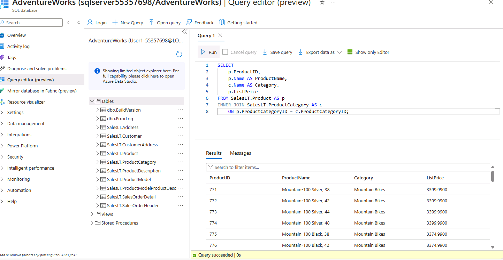
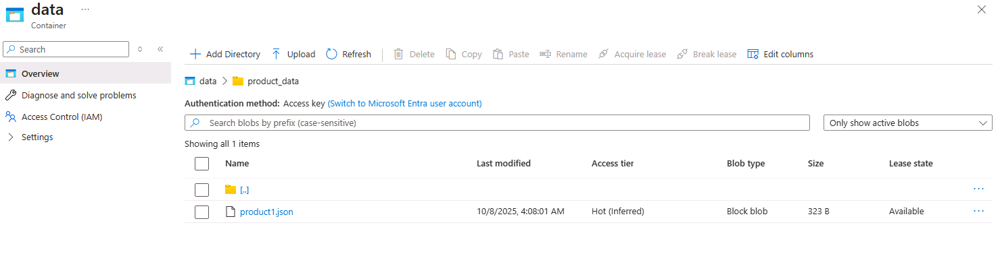
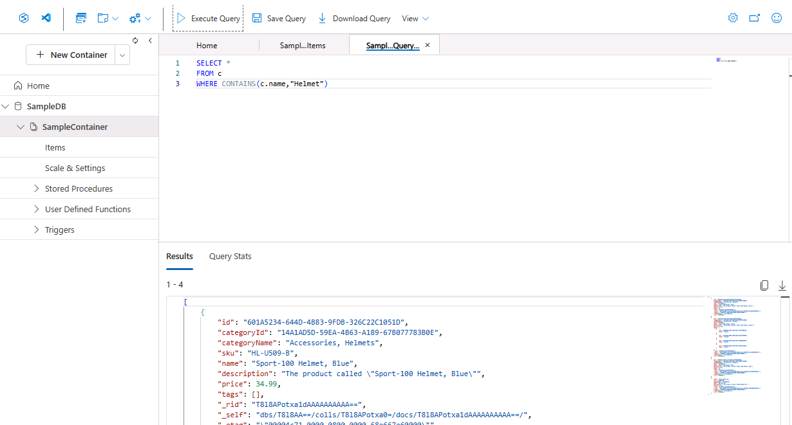
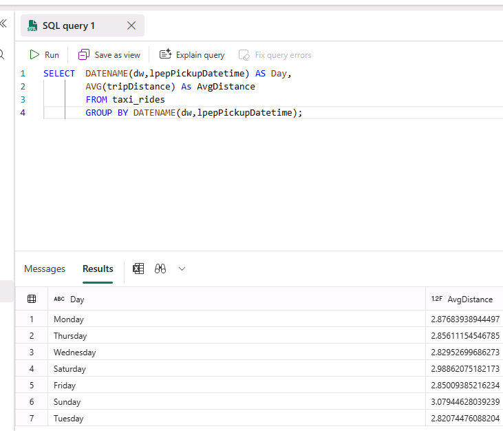
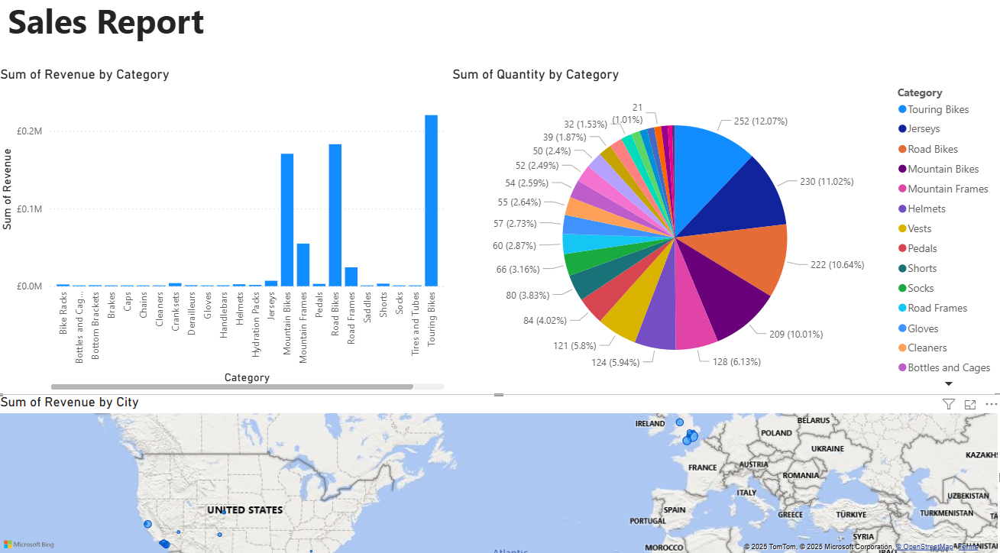
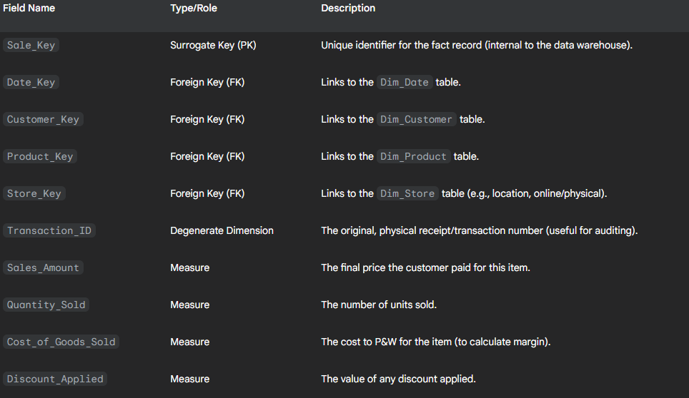

# Bootcamp - Week 5
This is theWorkbook for Week 5 of a course delivered by Just IT, completed by Laura Brown.

Note: There is no week 4 for this coursework

This week focuses heavily on the practical application of data manipulation and analysis using Python, specifically leveraging the Pandas library for data frames and the Jupyter Notebook environment.

## Key Topics and Skills Demonstrated

### Python & Jupyter Notebook Fundamentals

This section confirms proficiency with setting up the data analysis environment and handling basic data operations:

- **Environment Setup**: Setting up and confirming the working directory in a Jupyter Notebook.

- **Data Ingestion**: Loading a `.csv` file (Worldometers) into a Pandas DataFrame and performing an initial inspection.

- **Data Frame Inspection**: Using core Pandas functions to check the data's dimensions and structure:
  - Shape and Size of the DataFrame.
  - Displaying the first 5 rows and last 5 rows (`head()` and `tail()`).
  - Generate a summary/descriptive statistics of the data.

### Data Cleaning and Preprocessing

This task demonstrates essential data cleaning techniques critical for preparing data for analysis:

- **Handling Missing Values**: Using Pandas to identify and count Null/NaN values across all columns.

- **Data Type Conversion**: Converting the Population column to an appropriate data type (likely an integer or float).

- **Renaming Columns**: Renaming the Country (or dependency) column to the more concise Country.

- **Data Formatting**: Removing a specific character (e.g., a comma or a percentage sign) from a column to prepare it for numerical calculations.

- **Handling Duplicates**: Identifying, counting, and removing duplicate rows from the dataset.

- **Data Filtering**: Filtering the data to include only countries from a specific continent, such as Asia.

### Data Analysis and Feature Engineering

This final section showcases analytical skills, the ability to derive new information, and data visualization:

- **Statistical Analysis**: Calculating the mean, median, and mode of the Population column for the filtered Asia dataset.

- **Feature Engineering**: Creating a new column, Ratio, by dividing two existing numerical columns.

- **Data Aggregation**: Using `groupby()` to aggregate data and count the number of countries per continent.

- **Hypothesis Testing**:
  - Testing a hypothesis about a country having a high density.
  - Testing a hypothesis that a specific continent (e.g., Africa) has the largest population.

- **Data Visualisation**: Creating a basic visualisation (e.g., a bar chart or line chart) using a Python library (likely Matplotlib or Seaborn) for the number of countries per continent.

- **Exporting Data**: Saving the cleaned and processed DataFrame into a new `.csv` file.

## Portfolio Value

This workbook provides concrete evidence of hands-on skills in the entire data processing pipeline using Python (Pandas): from data loading and initial inspection to rigorous cleaning, feature creation, statistical analysis, hypothesis testing, and final data visualisation/export. It demonstrates proficiency with industry-standard tools for data wrangling.